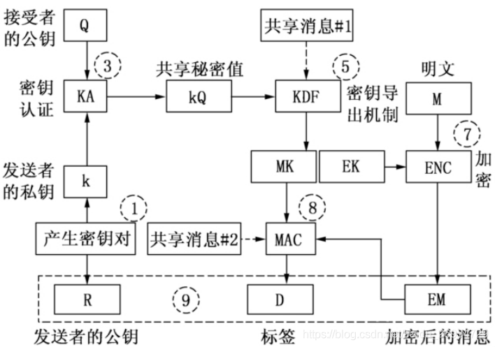

# ECIES 加密算法说明

1.选择一个在 1 和 n － 1 之间的临时随机整数k，计算 R = kG = ( Gx，Gy) 。  
2.将点 R 转换成八进制字符串 R’。  
3.由临时密钥 k 和公钥 Q 得到共享秘密域元素 z，( 例如 P = ( Gx，Gy) = kQ，令 z = xp) 。    
4.将 z 转换成八进制字符串 Z。  
5.根据配置文件用 KDF 函数从 Z 和［共享消息#1］ 产生密钥数据 K。  
6.按照配置文件从 K 中提取加密密钥 EK 和MAC 密钥 MK。  
7.根据配置文件中的对称加密函数和 EK，加密消息 M 得到密文 EM。  
8.根据配置文件中的 MAC 函数和 MK，由 EM‖［共享消息#2］ 得到 D。  
9.输出 C = R’‖EM‖D。